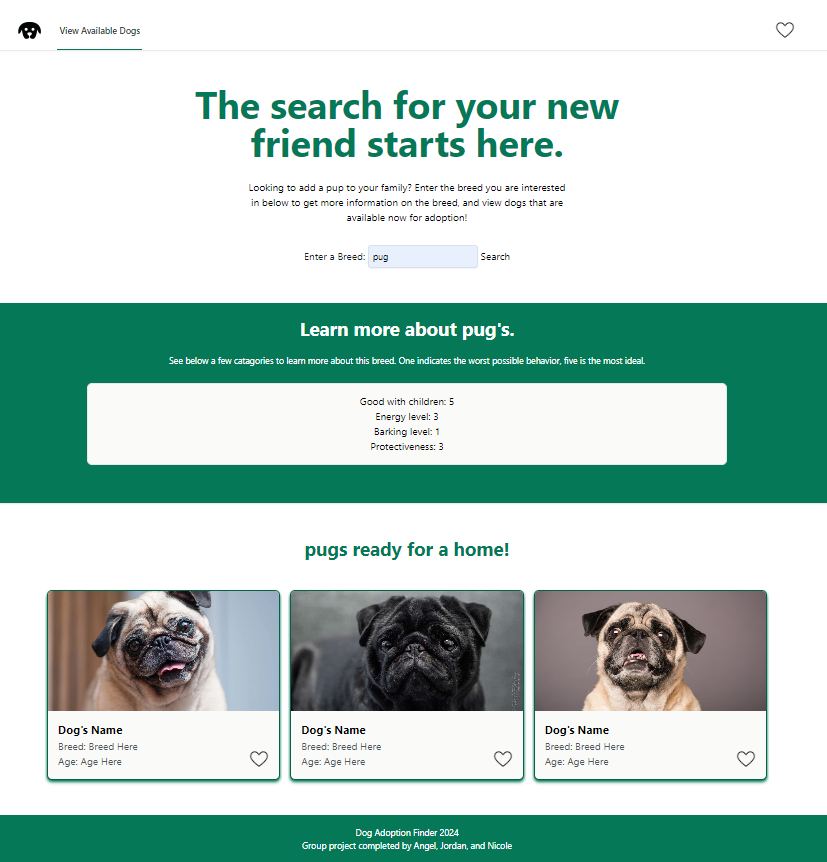

# Dog Adoption Finder

## Overview
This is a dog adoption finder for people who wish to find a dog to adopt, and also learn more about owning the breed. A user will come to the website, and enter a breed name they would like to search for. Then data will populate showing details about the breed such as life expectancy, typical activity levels, and so on. They will also scroll down and see three dogs available to be adopted. The user will be able to "favorite" a dog available for adoption to view later under their "favorites".

## Built With
This project is built using HTML, Tailwind, and Javascript.
Two APIs were also used - PetFinder (https://www.petfinder.com/developers/) and Dogs API (https://api-ninjas.com/api/dogs).

## License
MIT (https://choosealicense.com/licenses/mit/)

## Credits & Creators 
This was a group effort, each playing our own parts and coming together when needed to help one another. Tasks were generally split as follows- Angel worked on the PetFinder API and displaying necessary information to the adoptable dog cards. Jordan worked with the Dog API to gather information on the searched for breed and displayed back to the user. Nicole built the user interface, and the saved favorites feature.

## Project Status & Future Features
This is a complete project as is. However, some ideas for future improvement would be -

Adding additional dogs to view, possibly a scroll feature to look through all available dogs under the searched breed.

Adding a location of the dog, and possibly calculating distance from the user. 

Coming up with a better way to display facts/information about the breed.

GitHub Repo: https://github.com/NicoleBrubaker/dog-adoption-finder 

Live Site: https://nicolebrubaker.github.io/dog-adoption-finder/

